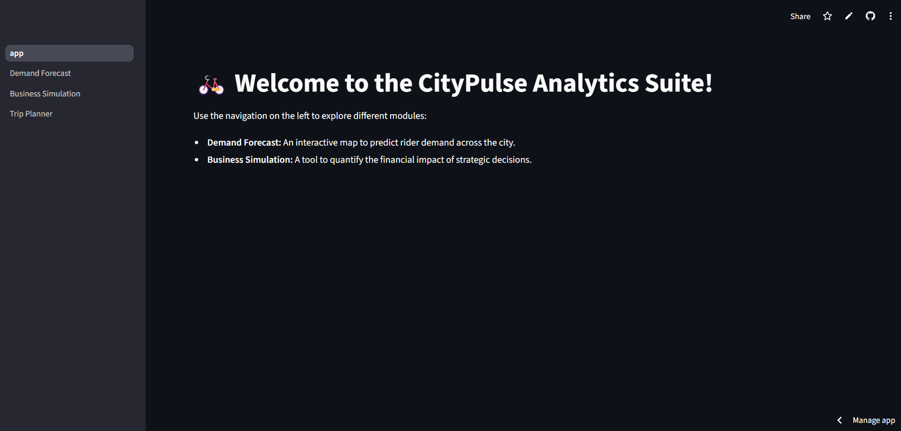
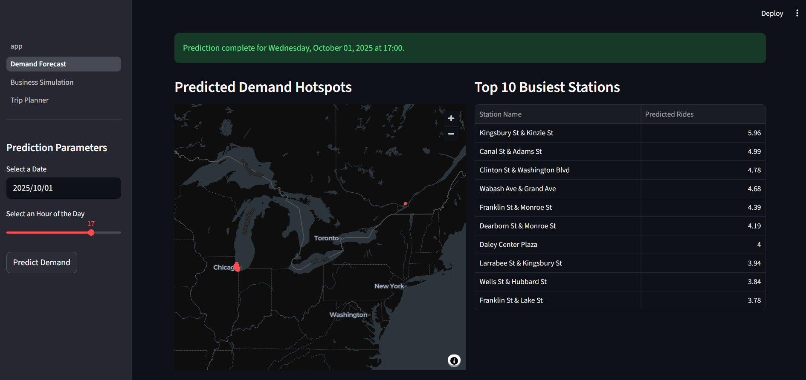
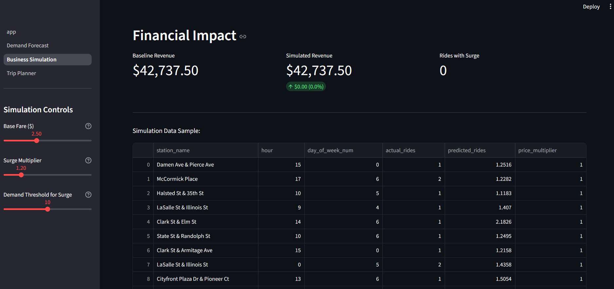
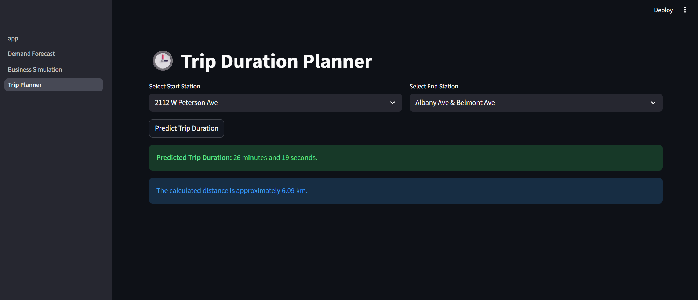

# CityPulse: E-Scooter Demand Forecasting & Business Analytics Suite


An end-to-end data science project that analyzes urban e-scooter trip data to forecast demand, simulate business strategies, and provide operational insights through an interactive web application.

---

### 🚀 Live Demo

**[Access the interactive dashboard here!](https://hardik-kaushik-scooter-analytics-project-app-lwrrw9.streamlit.app/)**

---

### ✨ Key Features

This project is deployed as a multi-page Streamlit application with three core modules:

1.  **Demand Forecast:**
    * Utilizes a Random Forest Regressor model to predict hourly rider demand for every station in the city.
    * Features an interactive map that visualizes demand hotspots for any selected date and time.
    * Displays a real-time table of the top 10 busiest stations based on the forecast.

    

2.  **Business Impact Simulation:**
    * A strategic tool that quantifies the financial impact of business decisions.
    * Allows users to interact with sliders to adjust parameters like `Base Fare`, `Surge Price Multiplier`, and `Demand Threshold`.
    * Calculates and displays the projected revenue uplift and key metrics, directly connecting the ML model to business value.

    

3.  **Trip Planner:**
    * Integrates a second machine learning model trained to predict trip duration in seconds.
    * Users can select a start and end station to get an estimated travel time, powered by a model that considers distance, time of day, and day of week.

---

### 🛠️ Tech Stack

* **Data Analysis & ML:** Python, Pandas, NumPy, Scikit-learn, Joblib, Geopandas
* **Web Application:** Streamlit
* **Data Visualization:** Matplotlib, Seaborn, Streamlit's native components
* **Version Control & Deployment:** Git, GitHub, Streamlit Community Cloud

---









### 📂 Project Structure
```
scooter_analytics_project/
├── app.py                   # Main Streamlit landing page
├── pages/
│   ├── 1_Demand_Forecast.py   # Page for the demand map
│   ├── 2_Business_Simulation.py # Page for the financial simulation
│   └── 3_Trip_Planner.py      # Page for the trip duration model
├── notebooks/
│   ├── 01_scooter_eda.ipynb
│   ├── 02_demand_modeling.ipynb
│   └── 03_duration_modeling.ipynb
├── data/
│   └── README.md              # Placeholder for instructions on where to get data
├── output/
│   ├── demand_forecast_model.pkl
│   ├── duration_model.pkl
│   └── ...                    # Other generated files (ignored by git)
├── .gitignore
└── requirements.txt
```

---

### ⚙️ Setup and Local Installation

To run this project on your local machine, follow these steps:

1.  **Clone the Repository:**
    ```bash
    git clone [https://github.com/YourUsername/scooter-analytics-project.git](https://github.com/YourUsername/scooter-analytics-project.git)
    cd scooter-analytics-project
    ```

2.  **Create and Activate a Virtual Environment:**
    ```bash
    # Create the environment
    python -m venv venv

    # Activate it (Windows)
    .\venv\Scripts\activate

    # Activate it (macOS/Linux)
    source venv/bin/activate
    ```

3.  **Install Dependencies:**
    ```bash
    pip install -r requirements.txt
    ```

4.  **Download the Data:**
    * The raw trip data is not included in this repository due to its size.
    * Download the dataset from [Kaggle: Divvy Bikes (Chicago) Dataset](https://www.kaggle.com/datasets/aroomi/divvy-bikes-chicago-dataset) and place the CSV file(s) inside the `data/` folder.

5.  **Generate Model Assets:**
    * Open and run the Jupyter Notebooks in the `notebooks/` folder in sequential order (`01` -> `02` -> `03`).
    * This is a crucial step as it will train the ML models and save the necessary `.pkl` and `.csv` files inside the `output/` directory, which the Streamlit app depends on.

6.  **Run the Streamlit App:**
    ```bash
    streamlit run app.py
    ```
    The application will open in your web browser.